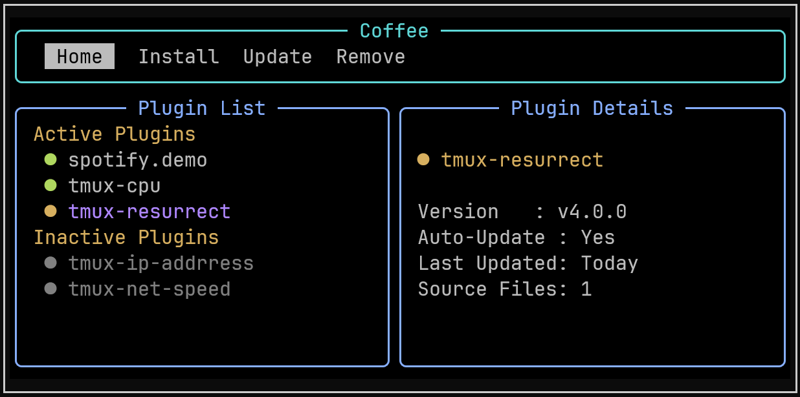

# ☕ Coffee - Modern tmux Plugin Manager

[](LICENSE) [](https://www.python.org/downloads/)

Coffee.tmux is a modern and intuitive tmux plugin manager with powerful CLI and terminal UI (TUI). It empowers users to easily install, update, enable/disable, and remove tmux plugins with rich progress feedback and asynchronous operations.



## Why Coffee.tmux?

If you’ve used TPM, you know how useful it is, but also how easily `.tmux.conf` can turn into a long, messy file as setups grow, making debugging harder and often leaving you hoping everything just works.

Coffee.tmux keeps the same git-native simplicity and adds clean YAML configuration, a proper CLI, and a modern TUI, so managing tmux plugins stays natural and fast.

## Features

### 🚀 Modern Interface

- Rich Terminal UI (TUI) with tabbed navigation and detailed plugin information
- Comprehensive CLI with intuitive commands and progress feedback
- Real-time plugin status showing version, update status, source files, and last updated

### 📦 Smart Plugin Management

- YAML-based configuration - cleaner than .tmux.conf declarations
- Version locking with rollback capabilities via lock files
- Selective updates - choose which plugins to update

### ⚡ Performance & Reliability

- Asynchronous operations with progress bars for faster installs/updates
- Git-native - direct repository cloning, tag checkout, and branch switching
- Atomic transactions - failed operations don't break your setup
- Enable/disable plugins without reinstallation

## Installation

### Prerequisites

- tmux 3.0+
- Python 3.10+
- git

### Clone

```bash
git clone https://github.com/PraaneshSelvaraj/coffee.tmux ~/.local/share/coffee
```

### Environment Setup

Coffee.tmux runs in its own dedicated Python environment to avoid dependency conflicts with your system Python.

Create and install dependencies into Coffee’s virtual environment:

```bash
cd ~/.local/share/coffee
python3 -m venv .venv
.venv/bin/python -m pip install -r requirements.txt
```

> Coffee always runs using this environment. You do not need to activate it manually.

### Add Coffee CLI to PATH

```bash
export PATH="$HOME/.local/share/coffee/bin:$PATH"
```

Add this line to your shell config file (e.g. `~/.bashrc` or `~/.zshrc`) to make it permanent.

### tmux Configuration

Add the following to your `.tmux.conf` (or `$XDG_CONFIG_HOME/tmux/tmux.conf`):

```bash
source-file ~/.local/share/coffee/coffee.tmux
```

After editing your tmux config, reload it with:

```bash
tmux source-file ~/.tmux.conf
```

## Setting up Plugins

Coffee.tmux is now installed and integrated with tmux. The next step is configuring your plugins.

### Migrating from TPM

If you already use TPM, Coffee can migrate your setup automatically.

```bash
coffee migrate
```

Coffee.tmux will scan your tmux config, detect existing TPM plugins, and generate minimal Coffee YAML configs

> This process is safe and non-destructive. Coffee.tmux does not modify or delete your tmux config.

### Fresh Setup

Create plugin configurations under:

```bash
~/.config/tmux/coffee/plugins/
```

Each plugin is defined in its own YAML file.

### Minimal Plugin Configuration

This is all you need to install a plugin.

```yaml
# ~/.config/tmux/coffee/plugins/tmux-resurrect.yaml
url: "tmux-plugins/tmux-resurrect"
```

Coffee.tmux automatically detects source files and manages installation and updates.

## Installing Plugins

After setup and reloading tmux, run:

```bash
coffee install
```

This installs all plugins configured in your YAML files.

## Advanced Plugin Configuration

For users who want full control.

```yaml
# ~/.config/tmux/coffee/plugins/tmux-resurrect.yaml
name: "tmux-resurrect"
url: "tmux-plugins/tmux-resurrect"
tag: "v3.0.0"
skip_auto_update: false
source: ["resurrect.tmux"]
```

Fields:

- `name`: Explicit plugin name
- `url`: GitHub repo path `<owner>/<repo>` (required)
- `tag`: Optional GitHub tag
- `skip_auto_update` : Disable automatic updates (default: false)
- `source`: List of plugin source script files loaded by tmux
  
## Usage

### CLI Commands

```bash
coffee install # Install configured plugins
coffee update # Check for plugin updates
coffee upgrade # Upgrade plugins with available updates
coffee upgrade tmux-sensible # Upgrade a specific plugin
coffee remove tmux-sensible # Remove a plugin
coffee list # List installed plugins
coffee info tmux-sensible # Show plugin details
coffee enable tmux-sensible # Enable a plugin
coffee disable tmux-sensible # Disable a plugin
```

### TUI Interface

Launch the TUI interface by pressing the keybinding (e.g., `prefix + C`).

Navigate with keys:

- `H` - Home tab (view installed/enabled plugins)
- `I` - Install tab (view and install plugins from config)
- `U` - Update tab (check and apply updates)
- `R` - Remove tab (remove plugins)

Use `j`/`k` or arrow keys to move selections, `Space` to mark/toggle, and follow on-screen controls.

## Contributing

Contributions are welcome! See [CONTRIBUTING.md](CONTRIBUTING.md) for guidelines on:

- Setting up your development environment
- Reporting issues and requesting features
- Coding style and tests
- Submitting pull requests

## License

This project is licensed under the MIT License - see the [LICENSE](LICENSE) file for details.

## Acknowledgements

Inspired by [tmux-plugins/tpm](https://github.com/tmux-plugins/tpm), and powered by [rich](https://github.com/Textualize/rich) and [textual](https://github.com/Textualize/textual).

## Contact

Maintainer: Praanesh S  
GitHub: [PraaneshSelvaraj](https://github.com/PraaneshSelvaraj)  
Email: praaneshselvaraj2003@gmail.com

For questions or support, please open an issue on GitHub.
